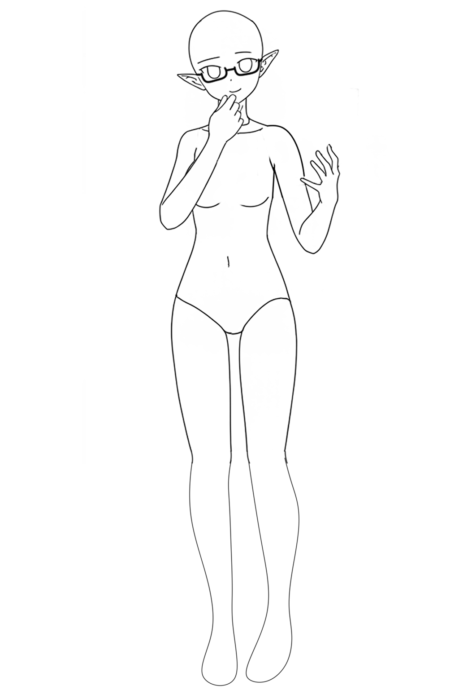

# ComfyUI-MiniMaxH3-SingleFrame

[日本語](#日本語) | [English](#english)

## 日本語

MiniMax H3で、1フレーム生成や始点/終点フレーム補間を扱うための実験的なComfyUIカスタムノードです。

通常の動画生成ノードとしてではなく、画像編集や始点/終点フレーム補間を静止画ワークフローに近い形で扱うことを目的にしています。

### できること

#### 1枚の画像をMiniMax H3で編集する

入力画像を0番フレームに固定し、1フレームのlatentを直接生成します。静止画編集に近い使い方です。

Prompt:

```text
The scenery doesn't move at all, and the camera is fixed. It switches from day to night.
```

| 入力画像 | 出力例 |
| --- | --- |
|  |  |

#### 始点と終点から中間フレームを作る

`start_frame` と `end_frame` を固定し、その間をMiniMax H3で推論して、中間の1枚を取り出します。ポーズ参照からキャラデザインへ寄せる用途などに使えます。

Prompt:

```text
Transform the first frame pose reference into the character from the final frame in two stages.
First, make the final-frame character take the first-frame pose and expression.
Then gradually refine the posed character into the final character design.
```

| 始点 | 終点 | 中間フレーム例 |
| --- | --- | --- |
|  |  |  |

### ノード

- `MiniMax H3 Single Frame Edit`: 入力画像とプロンプトからMiniMax H3用のconditioningとAV latentを作ります。`frame_count` のデフォルトは `1` で、1つのvideo latent tokenから1フレームだけをデコードします。`keyframe` は入力画像を0番フレームに固定し、`reference` は `<Picture 1>` の参照画像として使います。
- `MiniMax H3 Start End Frame Interpolate`: `start_frame` を0番フレーム、`end_frame` を `frame_count - 1` に固定します。`frame_count` のデフォルトは `5` です。
- `MiniMax H3 Temporal RoPE Patch`: target video tokenの時間RoPEを指定フレームへ寄せる実験用MODELパッチです。静止画寄りの出力を狙う場合に使います。
- `Empty MiniMax H3 Single Frame Latent`: カスタムワークフロー向けにMiniMax H3互換の空AV latentを作ります。

### フレーム数

MiniMax H3互換の都合で、複数フレームの `frame_count` は次の条件を満たす値に切り上げます。

```text
frame_count % 17 == 5
```

例:

```text
5  -> 5
6  -> 22
21 -> 22
22 -> 22
23 -> 39
```

`MiniMax H3 Single Frame Edit` では実験的な静止画パスとして `frame_count = 1` も使えます。`2` から `4` は従来どおり5フレーム互換グリッドに丸めます。Start/End補間の最小値は `5` のままです。

### Temporal RoPE Patch

`MiniMax H3 Temporal RoPE Patch` は、MODELを受け取ってMODELを返します。UNET Loaderの後、KSamplerへ入る前に接続してください。

- `frame_index`: 時間RoPEの基準にするlatentフレームです。デフォルトは `0` です。
- `strength`: 通常の時間RoPEから固定RoPEへ寄せる強さです。デフォルトは `1.0` で、指定フレームへ完全固定します。`0.5` で半分だけ寄せ、`0.0` でRoPE導入前と同じ挙動です。

デフォルトの `frame_index = 0`, `strength = 1.0` は静止画寄りの出力を狙う設定です。動き、色変化、時間方向のドリフトが減る可能性があります。効きが強すぎて崩れる場合は `strength = 0.25` から `0.75` の範囲で下げてください。

これは実験機能です。学習時の時間配置から外れるため、にじみ、反復模様、質感劣化、構図崩れが出る場合もあります。効果がない、または悪化する場合は `strength = 0.0` に戻してください。

RoPE固定が向いているのは、入力画像の構図、ポーズ、輪郭をなるべく動かさず、1枚絵編集のように使いたい場合です。たとえば、目だけ閉じる、表情だけ変える、服や背景を少し変える、といった小さい編集では効果が出ることがあります。

RoPE固定を弱めるか無効にした方がよいのは、Start/End補間、ポーズ参照からキャラデザインへの変換、22フレーム以上の中間フレーム抽出など、時間方向の変化そのものを使いたい場合です。RoPE固定が強すぎると、補間が片方のフレームに寄ったり、変化が固まりすぎたりすることがあります。

`strength` の目安:

```text
0.0  = 通常のMiniMax H3
0.25 = 少しだけ動きを抑える
0.5  = 中間
0.75 = かなり固定
1.0  = 指定フレームへ時間RoPEを固定
```

Start/End補間では `0.0` から `0.25`、静止画編集では `1.0` から試すのがおすすめです。

### サンプルワークフロー

- `example_workflows/minimax_h3_single_frame_edit_basic.json`
- `example_workflows/minimax_h3_start_end_interpolate_middle.json`

ComfyUIでワークフローを開き、UNET、CLIP、VAE、入力画像のファイル名を手元のMiniMax H3環境に合わせて変更してください。
`sample` ディレクトリにはワークフロー確認用の入力画像例があります。

このカスタムノードはMiniMax H3本体のモデルコードを直接パッチしません。

### MiniMax H3 Target Index RoPE Patch

`MiniMax H3 Target Index RoPE Patch` は、musubi-tuner PR #1058 の 1フレーム FL2VA 画像編集LoRA向けの MODEL パッチです。UNET Loader と LoRA Loader の後、KSampler の前に接続してください。

学習TOMLが次の設定の場合:

```toml
fp_1f_clean_indices = [0]
fp_1f_target_index = 24
```

推論側は次の設定にします:

```text
target_index = 24
strength = 1.0
```

この用途では `MiniMax H3 Single Frame Edit` を `frame_count = 1`、`image_mode = keyframe` で使います。`image_mode = reference` は Ref2VA 的な参照画像扱いになるため、このFL2VA画像編集LoRAでは使わないでください。

`MiniMax H3 Temporal RoPE Patch` とは用途が違います。Temporal RoPE Patch は生成tokenを latent frame index に寄せる実験用パッチです。Target Index RoPE Patch は、学習時の `fp_1f_target_index` と同じ pixel-frame index へ target video token の RoPE を合わせるためのパッチです。

## English

Experimental ComfyUI custom nodes for MiniMax H3 single-frame generation and start/end frame interpolation.

These nodes are intended for image-editing-like workflows and start/end frame interpolation, not as a general video generation wrapper.

### What This Can Do

#### Edit one image with MiniMax H3

The input image is anchored at frame 0 and MiniMax H3 generates a single-frame latent directly. This is intended for still-image-like editing.

Prompt:

```text
The scenery doesn't move at all, and the camera is fixed. It switches from day to night.
```

| Input image | Example output |
| --- | --- |
|  |  |

#### Create a middle frame from start and end images

The `start_frame` and `end_frame` are anchored, MiniMax H3 infers the frames between them, and one middle frame is extracted. This can be used for workflows such as converting a pose reference toward a character design.

Prompt:

```text
Transform the first frame pose reference into the character from the final frame in two stages.
First, make the final-frame character take the first-frame pose and expression.
Then gradually refine the posed character into the final character design.
```

| Start | End | Example middle frame |
| --- | --- | --- |
|  |  |  |

### Nodes

- `MiniMax H3 Single Frame Edit`: Creates MiniMax H3 conditioning and an AV latent from an input image and prompt. `frame_count` defaults to `1`, which uses a single video latent token and decodes one frame. `keyframe` anchors the input image at frame 0, while `reference` uses it as `<Picture 1>` reference conditioning.
- `MiniMax H3 Start End Frame Interpolate`: Anchors `start_frame` at frame 0 and `end_frame` at `frame_count - 1`. `frame_count` defaults to `5`.
- `MiniMax H3 Temporal RoPE Patch`: An experimental MODEL patch that pulls the target video token temporal RoPE toward one selected frame. Use it when trying to make the output more still-image-like.
- `MiniMax H3 Target Index RoPE Patch`: A MODEL patch for one-frame FL2VA image-edit LoRAs trained with an explicit MiniMax-H3 one-frame target index, such as `fp_1f_target_index = 24` in musubi-tuner PR #1058.
- `MiniMax H3 VAE Decode Frame`: Decodes the video stream from a MiniMax H3 AV latent and explicitly selects `first`, `middle`, `last`, `index`, or `all_frames`. For the experimental `frame_count = 1` path, the DiT output remains a single latent frame, but the node duplicates that latent only at VAE decode time, uses MiniMax H3's temporal decode path, and keeps the first decoded frame. Use `middle` for the 5-frame start/end interpolation sample.
- `Empty MiniMax H3 Single Frame Latent`: Creates an empty MiniMax H3-compatible AV latent for custom workflows.

### Frame Count

For MiniMax H3 compatibility, multi-frame requests are rounded up until `frame_count` satisfies:

```text
frame_count % 17 == 5
```

Examples:

```text
1
5
22
39
```

`MiniMax H3 Single Frame Edit` exposes only `1` and MiniMax H3-compatible multi-frame counts in the UI. `frame_count = 1` is an experimental still-image path. For Start/End interpolation, the minimum remains `5`, and only compatible multi-frame counts are shown.

### VAE Decode

MiniMax H3 latents are audio-video latents. ComfyUI's standard `VAEDecode` takes the first stream from nested AV latents and decodes the video, but it flattens decoded video frames into an IMAGE batch. The `MiniMax H3 VAE Decode Frame` node makes the frame selection explicit so the workflow does not depend on an implicit batch index.

For `frame_count = 1`, ComfyUI's MiniMax H3 VAE normally decodes one latent token through a direct single-clip path and keeps the last internal temporal slice. This node instead duplicates the generated single latent token to two tokens only before VAE decoding, calls the temporal decode path, and keeps the first decoded frame. For the default Start/End interpolation workflow with 5 decoded frames, select `middle` to get the generated middle frame rather than one of the anchored endpoint frames.

### Temporal RoPE Patch

`MiniMax H3 Temporal RoPE Patch` takes a MODEL and returns a MODEL. Connect it after the UNET Loader and before KSampler.

- `frame_index`: The latent frame used as the temporal RoPE reference. The default is `0`.
- `strength`: How strongly the normal temporal RoPE is pulled toward the fixed frame. The default is `1.0`, which fully freezes it to the selected frame. `0.5` pulls it halfway toward the selected frame, while `0.0` matches the behavior before this RoPE patch.

The default `frame_index = 0` and `strength = 1.0` is intended for still-image-like output. It may reduce motion, color shifts, and temporal drift. If the effect is too strong or causes artifacts, lower `strength` into the `0.25` to `0.75` range.

This is experimental. Because it changes the temporal position layout the model was trained with, it may also introduce smearing, repeated patterns, texture degradation, or composition errors. If it does not help, set `strength = 0.0`.

Temporal RoPE freezing is most useful when you want image-editing-like behavior: keep the input composition, pose, and silhouette as still as possible while making a small change. It may help with edits such as closing only the eyes, changing only the expression, or making a small clothing/background change.

Use a weaker value or disable it when you want real temporal change, such as Start/End interpolation, converting a pose reference into a character design over time, or selecting a middle frame from 22 or more generated frames. If the freeze is too strong, interpolation may collapse toward one endpoint or become too rigid.

Suggested `strength` values:

```text
0.0  = normal MiniMax H3 behavior
0.25 = slight motion reduction
0.5  = balanced
0.75 = strong freeze
1.0  = temporal RoPE fixed to the selected frame
```

For Start/End interpolation, try `0.0` to `0.25`. For still-image editing, start with `1.0`.

### Target Index RoPE Patch

`MiniMax H3 Target Index RoPE Patch` takes a MODEL and returns a MODEL. Connect it after the UNET Loader and LoRA Loader, and before KSampler.

Use this patch when running a one-frame MiniMax-H3 FL2VA image-edit LoRA trained with musubi-tuner's one-frame settings. For example, if the training TOML uses:

```toml
fp_1f_clean_indices = [0]
fp_1f_target_index = 24
```

then set:

```text
target_index = 24
strength = 1.0
```

For this workflow, use `MiniMax H3 Single Frame Edit` with `frame_count = 1` and `image_mode = keyframe`. Do not use `image_mode = reference` for this LoRA type, because the LoRA was trained as FL2VA conditioning from a control/keyframe image to a target image.

This patch is different from `MiniMax H3 Temporal RoPE Patch`. The temporal patch freezes the generated token toward a latent frame index. The target-index patch moves the generated target video token RoPE to the pixel-frame index used during one-frame LoRA training, so it should match `fp_1f_target_index`.

### Example Workflows

- `example_workflows/minimax_h3_single_frame_edit_basic.json`
- `example_workflows/minimax_h3_start_end_interpolate_middle.json`

Open a workflow in ComfyUI and replace the placeholder UNET, CLIP, VAE, and input image filenames with your local MiniMax H3 files.
The `sample` directory contains example input images for checking the workflows.

This custom node does not patch the MiniMax H3 core model code.
